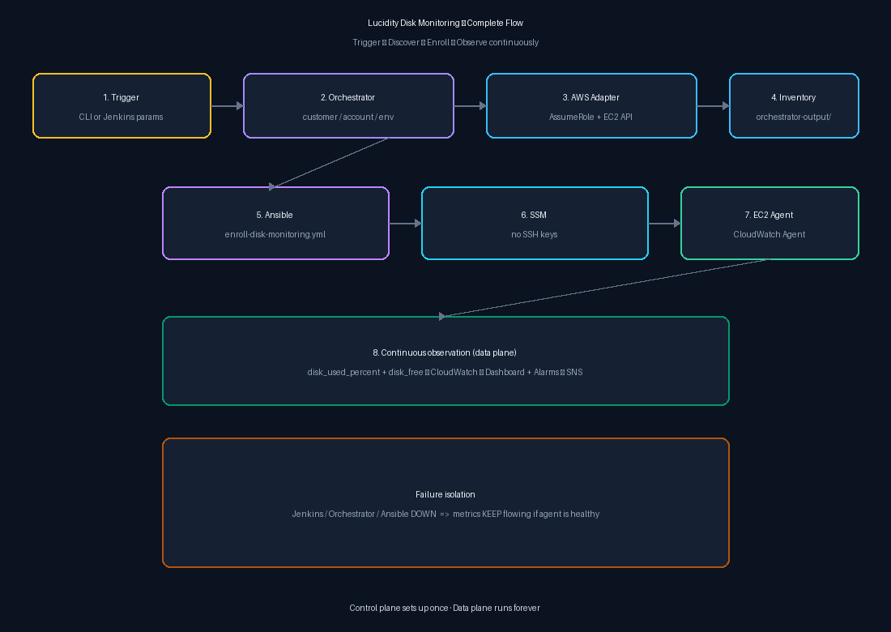

# Lucidity — Scalable Disk Monitoring for AWS

**What this is:** a Solution Architect design + working MVP that watches **disk space on EC2** across many AWS accounts (and is ready to extend to GCP/Azure later).

**One sentence:** Ansible *sets up* monitoring; CloudWatch *does* monitoring; Jenkins/Orchestrator only *trigger* setup.

---

## Start here (pick your goal)

| I want to… | Open this |
|------------|-----------|
| Understand the **whole system** with diagrams | [architecture/architecture.md](architecture/architecture.md) |
| Know what **each folder/file** means | [docs/09-repository-map.md](docs/09-repository-map.md) |
| Learn the words (SSM, AssumeRole, …) | [docs/00-glossary.md](docs/00-glossary.md) |
| Install tools | [docs/01-prerequisites.md](docs/01-prerequisites.md) |
| Run on **my AWS account** (single account) | [docs/02-single-account-onboarding.md](docs/02-single-account-onboarding.md) |
| Add **more AWS accounts** | [docs/03-multi-account-onboarding.md](docs/03-multi-account-onboarding.md) |
| Try discovery **without AWS** (dry-run) | [docs/06-orchestrator-dry-run.md](docs/06-orchestrator-dry-run.md) |
| Understand Nike/Adidas multi-customer model | [docs/07-multi-customer-saas-model.md](docs/07-multi-customer-saas-model.md) |
| See Jenkins control-plane job | [docs/08-jenkins-thin-trigger.md](docs/08-jenkins-thin-trigger.md) |
| Prove everything works | [docs/04-validation-checklist.md](docs/04-validation-checklist.md) |
| Fix a failure | [docs/05-troubleshooting.md](docs/05-troubleshooting.md) |



---

## How it works (short)

```text
  You or Jenkins
        │  parameters: customer / account / environment / region
        ▼
  Python Orchestrator  ──AWS Adapter──►  AssumeRole  ──►  find tagged EC2
        │
        ▼
  Inventory files in ansible/inventory/orchestrator-output/
        │
        ▼
  Ansible playbook enroll-disk-monitoring.yml
        │  via AWS Systems Manager (no SSH)
        ▼
  CloudWatch Agent on the VM  ──continuous──►  CloudWatch metrics
        │
        ├── Dashboard
        └── Alarms (80% / 90% / low free space / agent missing) → email
```

**If Jenkins or Ansible stops, metrics for already-enrolled VMs keep flowing.**

---

## Repository layout (human names)

| Path | Purpose |
|------|---------|
| `architecture/` | Full flow diagrams + explanation |
| `docs/` | Step-by-step guides (`00` … `09`) |
| `config/customer-accounts.template.yaml` | Sample customer→account registry (copy to `customer-accounts.yaml`) |
| `config/monitoring-profiles.yaml` | Disk warning/critical thresholds |
| `orchestrator/` | Discovers VMs; writes Ansible inventory |
| `jenkins/Jenkinsfile` | Architecture-stage control plane (discover → enroll/heal → validate) with retries |
| `terraform/environments/single-account-mvp/` | First AWS deploy (one account) |
| `terraform/environments/workload-account/` | IAM role inside a customer account |
| `terraform/environments/central-monitoring-account/` | Central dashboard + role registry |
| `ansible/playbooks/enroll-disk-monitoring.yml` | Install/configure agent |
| `ansible/playbooks/reconcile-agent-config.yml` | Fix drift / restart agent |
| `ansible/playbooks/validate-agent-on-host.yml` | Assert agent health on the VM |
| `scripts/validate.sh` | Repo health check (no AWS) |
| `scripts/validate-cloudwatch-metrics.sh` | Wait until CloudWatch has datapoints |

Templates use the suffix **`.template`** (not “example”). Copy them to a real filename without committing secrets.

---

## Quick starts

### A) Check the repo (no AWS)

```bash
./scripts/validate.sh
```

**Expected:** ends with `FAIL=0`.

### B) Dry-run discovery (no AWS)

```bash
python3 -m pip install --user -r orchestrator/requirements.txt
PYTHONPATH=. python3 -m orchestrator \
  --cloud aws --customer nike --account 111111111111 \
  --environment prod --region us-east-1 --dry-run \
  --accounts-file config/customer-accounts.template.yaml
```

**Expected:** banner `MODE: DRY RUN`, two simulated hosts `i-DRYRUN…`, files under `ansible/inventory/orchestrator-output/`.

### C) Live single-account MVP (needs your AWS)

1. Apply Terraform in `terraform/environments/single-account-mvp/`  
2. Attach the instance profile; tag the EC2 (`Monitoring=enabled`, …)  
3. Run `ansible/playbooks/enroll-disk-monitoring.yml`  
4. Run `./scripts/validate-cloudwatch-metrics.sh --instance-id i-...`  

Full copy-paste steps with expected output: [docs/02-single-account-onboarding.md](docs/02-single-account-onboarding.md).

---

## Layer responsibilities

| Layer | Does | Does **not** |
|-------|------|----------------|
| Jenkins | Architecture stages: discover → enroll/autoheal → validate (with retries/waits) | Embed AWS API logic or continuous `df` polling |
| Orchestrator | Discover + inventory | Continuously poll disk |
| Terraform | IAM, dashboard, alarms (incl. agent-missing heal signal) | Configure packages on the OS |
| Ansible | Install/configure/heal agent via SSM (retries/until) | Act as the monitoring engine |
| CloudWatch Agent | Continuous disk metrics | Depend on Jenkins being up |

---

## Auto-healing & retries

| Mechanism | Where |
|-----------|--------|
| Package/service `retries` + `until` | Ansible `cloudwatch_agent` role |
| SSM backoff before heal | `reconcile-agent-config.yml` |
| Jenkins `retry()` + IAM wait gate | `jenkins/Jenkinsfile` stages |
| Metric poll wait loop | `scripts/validate-cloudwatch-metrics.sh` |
| Heal trigger | Alarm `disk-agent-missing-*` → Jenkins `ACTION=autoheal` |

Details: [docs/reliability.md](docs/reliability.md) · [docs/08-jenkins-thin-trigger.md](docs/08-jenkins-thin-trigger.md)

---

## Security snapshot

- No long-lived keys in git  
- Least-privilege roles (never `AdministratorAccess` for monitoring)  
- SSM preferred over SSH  
- Three roles: Orchestrator → Execution → Instance  

Details: [docs/security.md](docs/security.md)

---

## Honesty

- Validated statically via `./scripts/validate.sh` + orchestrator unit tests + dry-run  
- Live multi-account / 5,000-VM load was **not** claimed by the author  
- GCP/Azure adapters are **stubs** (extension points)  

---

## Definition of Done

Architecture, multi-account IAM, dynamic discovery, orchestrator dry-run, Ansible enrollment, CloudWatch metrics/alarms, beginner docs, security/reliability/tradeoffs, no secrets in repo — see checklist in older assignment notes; this repository is built to meet them.
