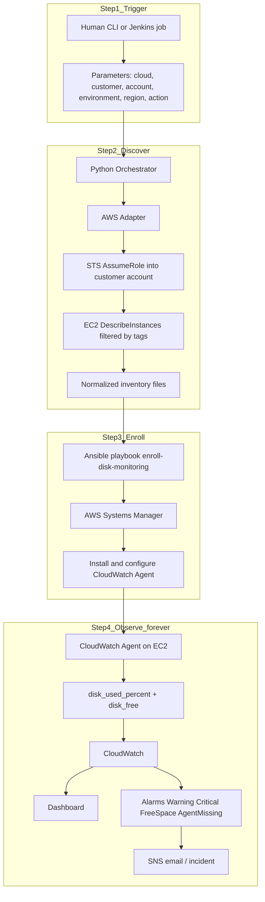
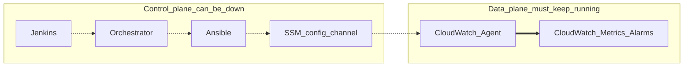
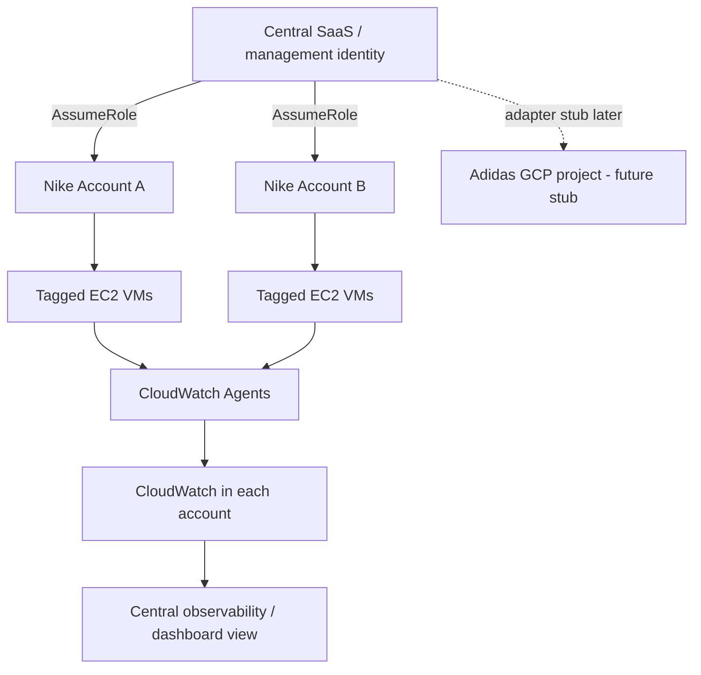
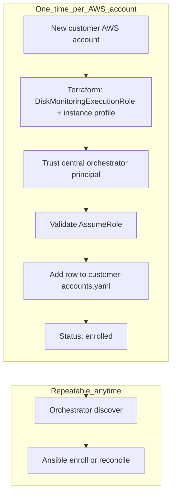
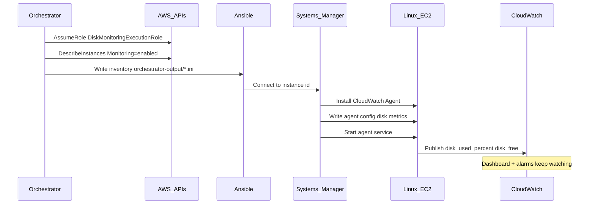

# Architecture — how Lucidity disk monitoring works

This page is for a human reviewer. It explains **what happens**, **in what order**, and **why each piece exists**.

If you only remember one sentence:

> **Jenkins/Orchestrator decide which VMs to set up. Ansible installs the agent. CloudWatch Agent + CloudWatch do continuous monitoring.**

---

## 1. The full story (end-to-end)



### Same flow in plain words

1. **Trigger** — You (or Jenkins) pass: customer=`nike`, account=`111…`, env=`prod`, region, action=`enroll`.  
2. **Discover** — Orchestrator assumes the monitoring role in that account and finds EC2 instances tagged for monitoring.  
3. **Enroll** — Ansible uses SSM (no SSH) to install/configure the CloudWatch Agent.  
4. **Observe** — The agent keeps sending disk metrics to CloudWatch. Dashboards and alarms work even if Jenkins/Ansible are offline.

---

## 2. Control plane vs data plane (critical design)



| If this is down… | Monitoring of already-enrolled VMs |
|------------------|--------------------------------------|
| Jenkins | **Continues** |
| Orchestrator | **Continues** |
| Ansible | **Continues** |
| CloudWatch Agent on a VM | **Stops for that VM** → agent-missing alarm |

This is why we never use Ansible to run `df -h` every minute.

---

## 3. Multi-customer SaaS shape



One Jenkins job / one orchestrator CLI. Parameters change per customer — **not** a new pipeline per customer.

---

## 4. One-time account onboarding vs repeatable enrollment



Adding Account #101 repeats the **one-time** box, then uses the **same** repeatable job.

---

## 5. What happens on a single VM



---

## 6. IAM roles (three different jobs)

```text
1) MonitoringOrchestratorRole (central)
      - Who: Jenkins agent / operator / python -m orchestrator
      - Job: Call STS AssumeRole into customer accounts

2) DiskMonitoringExecutionRole (inside each customer account)
      - Who: Assumed by #1
      - Job: Discover EC2, talk to SSM for enrollment, read metrics for validation
      - Trust policy: only #1 may assume (optional ExternalId)
      - Permissions policy: least privilege (NOT AdministratorAccess)

3) DiskMonitoringInstanceProfile (on each EC2)
      - Who: The VM itself
      - Job: Run SSM Agent + CloudWatch Agent
```

Trust policy = **who** may enter. Permissions policy = **what** they can do after entering.  
Details: [docs/security.md](../docs/security.md)

---

## 7. Tag contract (how a VM opts in)

| Tag | Sample value | Purpose |
|-----|--------------|---------|
| `Monitoring` | `enabled` | Include in discovery (opt-in) |
| `MonitoringProfile` | `standard` | Which threshold profile |
| `Environment` | `prod` | Filter by environment |
| `Customer` | `nike` | Filter by SaaS customer |

Governance choice: **opt-in** (safer for multi-tenant SaaS). See [docs/07-multi-customer-saas-model.md](../docs/07-multi-customer-saas-model.md).

---

## 8. Two operator paths (both correct)

### Path A — Single-account MVP (reviewer with one AWS account)

```text
terraform/environments/single-account-mvp
        → attach instance profile + tags
        → ansible -i inventory/aws_ec2.yml playbooks/enroll-disk-monitoring.yml
        → scripts/validate-cloudwatch-metrics.sh
```

Guide: [docs/02-single-account-onboarding.md](../docs/02-single-account-onboarding.md)

### Path B — Multi-customer (orchestrator)

```text
python -m orchestrator --customer nike --account … --dry-run|live
        → ansible -i inventory/orchestrator-output/*.ini playbooks/enroll-disk-monitoring.yml
```

Guide: [docs/06-orchestrator-dry-run.md](../docs/06-orchestrator-dry-run.md)

---

## 9. Where code lives (short map)

| Concern | Location |
|---------|----------|
| Discover VMs / AssumeRole | `orchestrator/` |
| Install agent on VM | `ansible/roles/cloudwatch_agent/` |
| Create IAM + alarms | `terraform/` |
| Dashboard JSON | `cloudwatch/` |
| Customer account list | `config/customer-accounts.template.yaml` |
| Alert thresholds | `config/monitoring-profiles.yaml` |
| CI trigger | `jenkins/Jenkinsfile` |

Full file dictionary: [docs/09-repository-map.md](../docs/09-repository-map.md)

---

## 10. Diagrams in this folder

| File | Use |
|------|-----|
| [architecture.png](architecture.png) | Visual overview for README / slides |
| [architecture.svg](architecture.svg) | Same diagram, vector |
| This markdown | Full explanation + mermaid flows |

---

## 11. What we deliberately did **not** build

- Custom monitoring UI / database  
- Ansible polling `df` forever  
- Separate Jenkins job per customer  
- Full GCP/Azure enrollment (stubs only)  
- Hard dependency on Control Tower  

Those would add complexity without helping the assignment’s SA goals.
